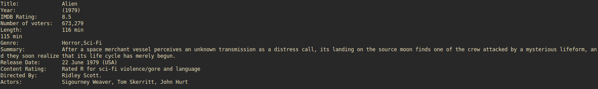

# findmovie

Fetch and display movie information from imdb.com in the terminal

---

## Getting Started

These instructions will get you a copy of the script up and running on your local machine

### Requirements

- [curl](https://curl.haxx.se/) - Transfer data from the server

Curl can be installed by your system package manager

```
sudo apt install curl
```

### Installing

Clone the repository, fetch the required submodules, make the script executable and run it 

```
  git clone https://github.com/miroslavvidovic/findmovie
  
  git submodule init
  
  git submodule update
  
  chmod +x findmovie
```

### Usage

```
  findmovie movie-name
  
  findmovie "Alien"
```


If you wish to change the output format edit the findmovie.mo file.

## Built with

- [mo](https://github.com/tests-always-included/mo) - Mustache templates in bash
- [bash-spinner](https://github.com/tlatsas/bash-spinner) - Small progress spinner

## Contributing

Please read [CONTRIBUTING.md](CONTRIBUTING.md) for details on our code of conduct, and the process for submitting pull requests.

## Authors

* **Miroslav Vidovic** -  [miroslavvidovic](https://github.com/miroslavvidovic)

## License

This project is licensed under the MIT License - see the [LICENSE.md](LICENSE.md) file for details
